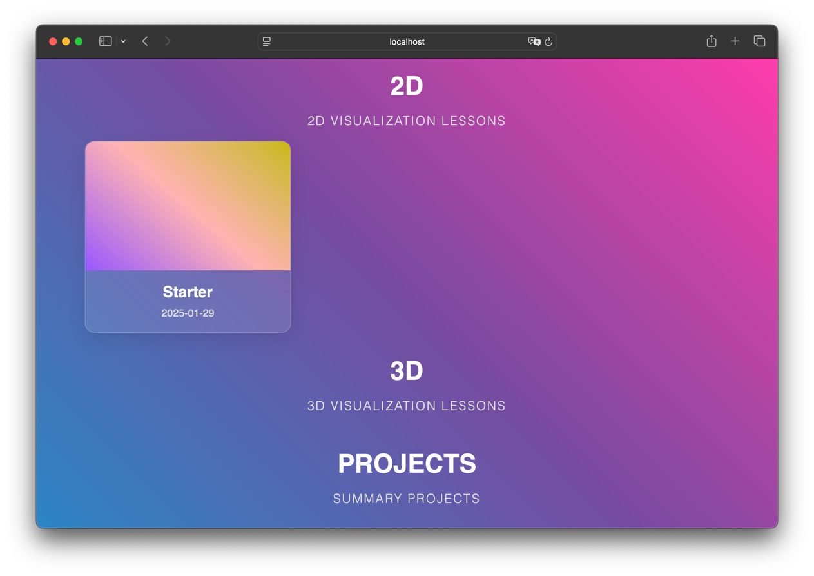

# Data Visualization Environment



## Project Overview
This project provides an environment for creating and managing data visualization tasks. The tasks are categorized into three types:
- **2D Visualizations**
- **3D Visualizations**
- **Projects** (comprehensive tasks)

## How to Create a Task
To create a new task, follow these steps:

1. **Use the Template Directory:**
    - Each task should be created using the "template directory," which contains two files:
        - `index.html`
        - `script.ts` (TypeScript file)

2. **Choose the Appropriate Category:**
    - Place the new task directory inside one of the following directories:
        - `src/tasks/2D/` (for 2D visualization tasks)
        - `src/tasks/3D/` (for 3D visualization tasks)
        - `src/tasks/Projects/` (for larger or mixed tasks)

3. **Run the Project:**
    - After adding a new task, start the project by running the following command in the terminal:
      ```sh
      npm run start
      ```

4. **View the Tasks in the Browser:**
    - Open the following URL in your browser:
      ```
      http://localhost:8080/
      ```
    - The main menu should appear, displaying solutions to your tasks.

## Project Structure
```
DataVisualizationEnv/
│── src/
│   ├── tasks/
│   │   ├── 2D/
│   │   │   ├── Task1/
│   │   │   │   ├── example.html
│   │   │   │   ├── example.ts
│   │   ├── 3D/
│   │   │   ├── Task2/
│   │   │   │   ├── example.html
│   │   │   │   ├── example.ts
│   │   ├── Projects/
│   │   │   ├── Task3/
│   │   │   │   ├── example.html
│   │   │   │   ├── example.ts
│   ├── template/
│   │   ├── example.html
│   │   ├── example.ts
│── package.json
│── webpack.config.js
│── README.md
```

## Dependencies
Ensure you have Node.js installed. The project relies on Webpack for bundling.
To install dependencies, run:
```sh
npm install
```

## Contribution
Feel free to contribute by adding new tasks and improving the environment. Follow the task creation rules to maintain consistency.

